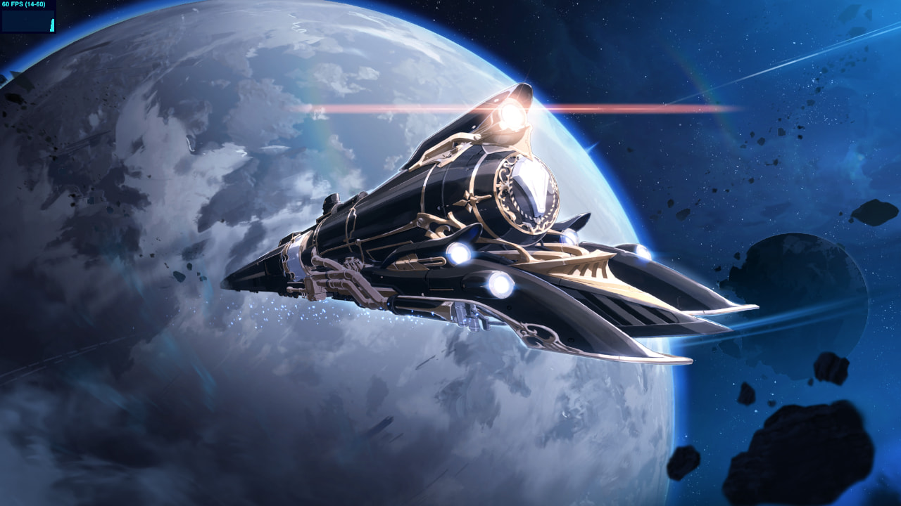

<p align="center"></p>



# honkai-starrail-scene
崩坏：星穹铁道 预约页场景提取 [Demo](https://lab.getloli.com/honkai-starrail-scene/)

## 技术栈
- Vue.js
- Three.js r100
- GSAP
- GLSL

## 原项目
https://webstatic.mihoyo.com/rpg/event/e20211008reserve/index.html

## 免责声明
本项目仅为学习 Three.js 和 GLSL 编程所用，部分代码来源于原始项目压缩混淆后的代码，为了方便学习转为人类易于理解的形式

项目中包含的渲染流程/动画配置和场景/材质/贴图/Shader等资产版权为米哈游公司所有，不得出于商业目的或提供付费支持服务而复制或传播上述内容的任何部分，由此造成的一切后果本代码仓库建立者概不负责

## Project setup
```
yarn install
```

### Compiles and hot-reloads for development
```
yarn serve
```

### Compiles and minifies for production
```
yarn build
```

### Customize configuration
See [Configuration Reference](https://cli.vuejs.org/config/).
